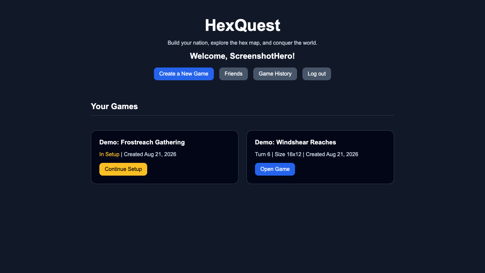
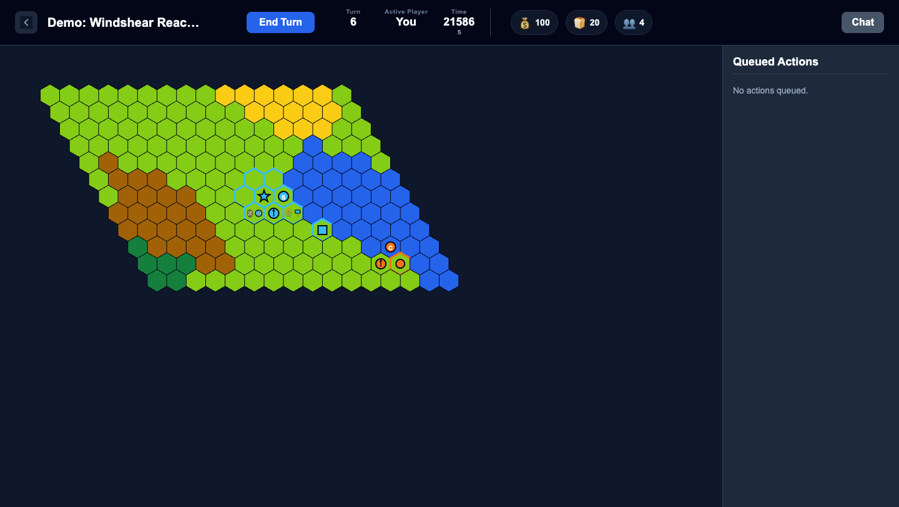
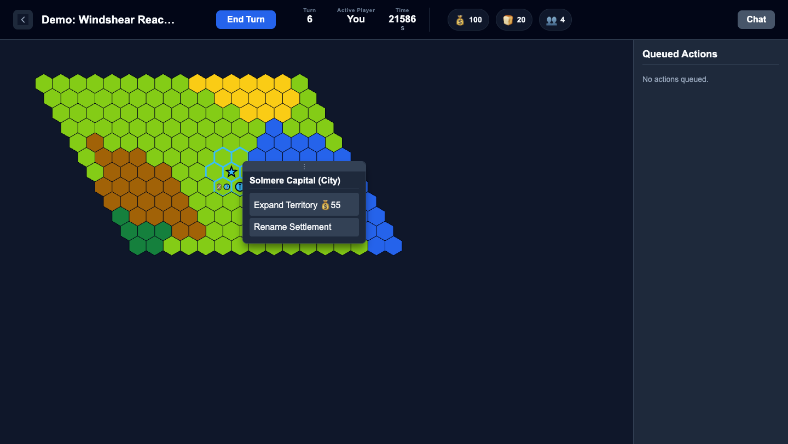
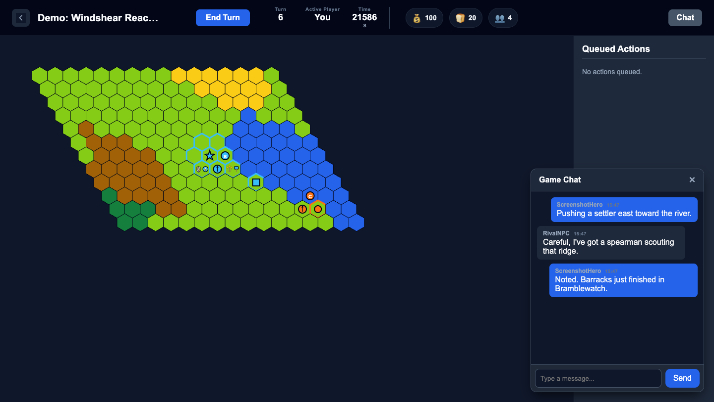
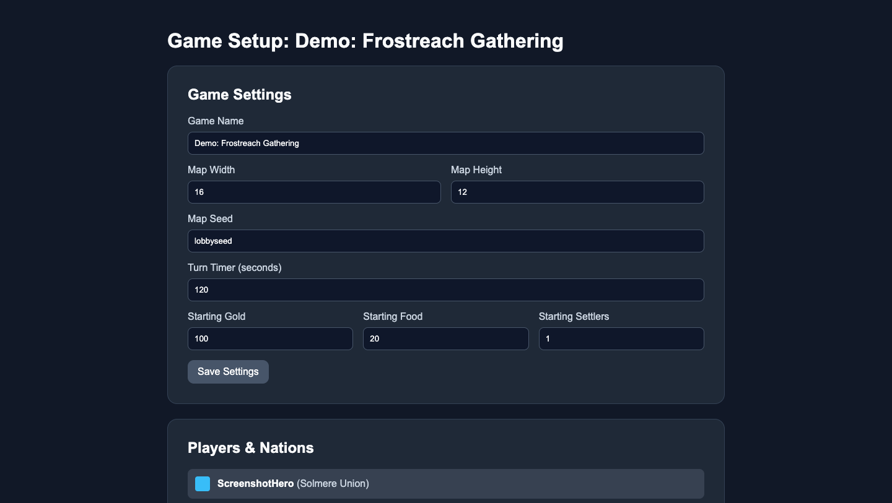

# HexQuest

A turn-based, multiplayer 4X strategy game played on a procedurally generated hex map. Found a settlement, expand your territory, build up your economy, and train an army to take on rival nations — all from the browser.



## Gameplay

Each game starts with a hex-grid world generated from a seed using Perlin noise, producing a mix of plains, forest, hills, mountains, desert, and water. Players take turns in sequence; when it's your turn you can move units, found and grow settlements, construct buildings, and queue up production, then end your turn for the next player. A per-game turn timer keeps things moving, and the timer keeps counting down locally even if you're not actively watching the page.



### Nations and expansion

- Start with a **Settler**, found your capital, and grow it from a Village into a Town and eventually a City.
- Spend gold to **expand territory**, claiming the hexes around your settlements.
- Train a **Builder** to construct buildings like Wheat Farms (food) and Barracks (unit recruitment).



### Combat

- Recruit combat units — **Spearmen** and **Swordsmen** — at a Barracks.
- Units have hitpoints, attack, and defense stats; damage is randomized within a range so fights stay unpredictable, with duels between full-strength units typically resolving in a handful of exchanges.
- Order an **Attack** to engage an enemy unit or contest a hex.

### Multiplayer and social features

- Invite friends to a game lobby before it starts, configure map size/seed, starting resources, and the turn timer, then kick off the match together.
- In-game **chat** keeps players coordinating without leaving the map.
- A **friends list** and game invite notifications make it easy to get a group into the same game.
- **Game history** keeps a record of your finished games.



### Game setup / lobby

Before a game starts, the creator can tune the map (width/height/seed), turn timer, and starting resources, and invite friends to join as rival nations.



## Tech stack

- **Backend:** Django, running under Daphne (ASGI) for combined HTTP + WebSocket support
- **Real-time updates:** Django Channels (in-memory channel layer locally, Redis-backed in production) for live game state and chat over WebSockets
- **Frontend:** Server-rendered templates with [htmx](https://htmx.org/) for partial updates, plain JS/SVG for the hex map, no frontend build step
- **World generation:** Perlin noise (`noise` / `pnoise2`) for terrain
- **Database:** PostgreSQL in production (via `dj-database-url`), SQLite for local development
- **Deployment:** Configured for DigitalOcean App Platform (`app.yaml`, `Procfile`)

## Running locally

Set up a virtual environment and install dependencies:

```bash
python3 -m venv venv
./venv/bin/pip install -r requirements.txt
```

Apply migrations and start the dev server:

```bash
cd project
../venv/bin/python manage.py migrate
../venv/bin/python manage.py runserver
```

The app defaults to a local SQLite database and an in-memory Channels layer, so no extra services are required to develop locally. Visit `http://localhost:8000` and register an account to create your first game.

### Running tests

```bash
cd project
../venv/bin/python manage.py test
```
